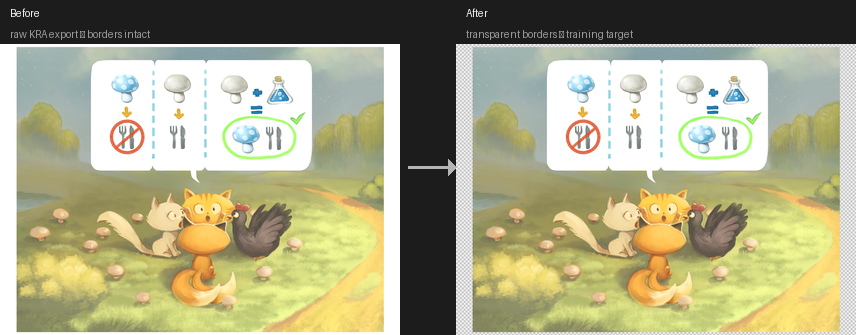
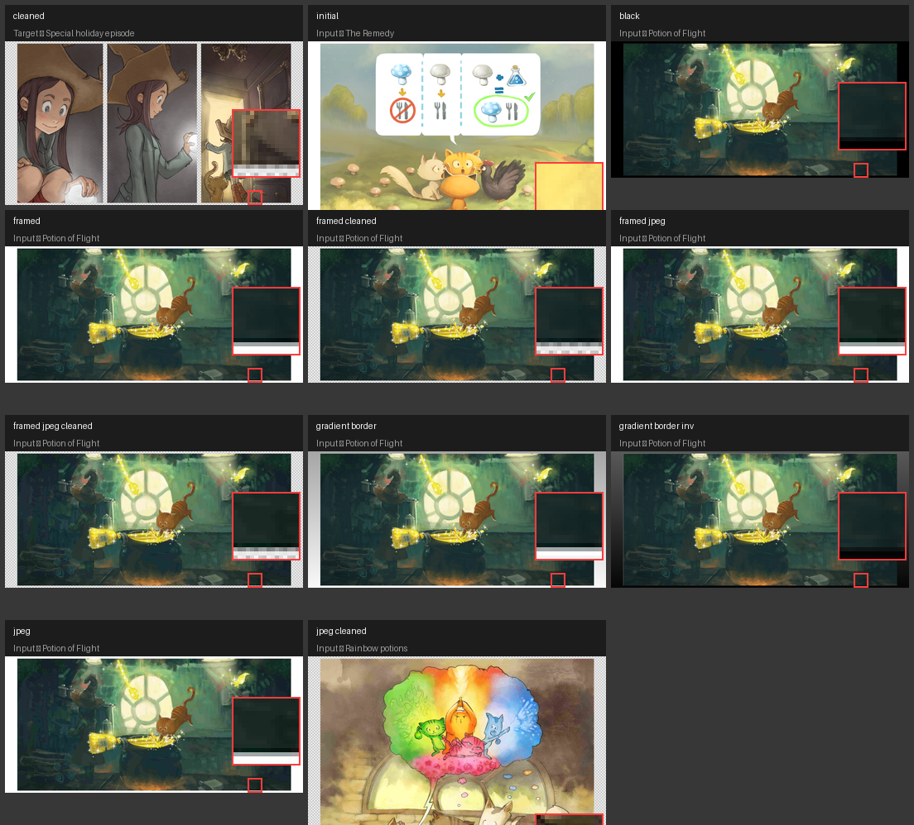
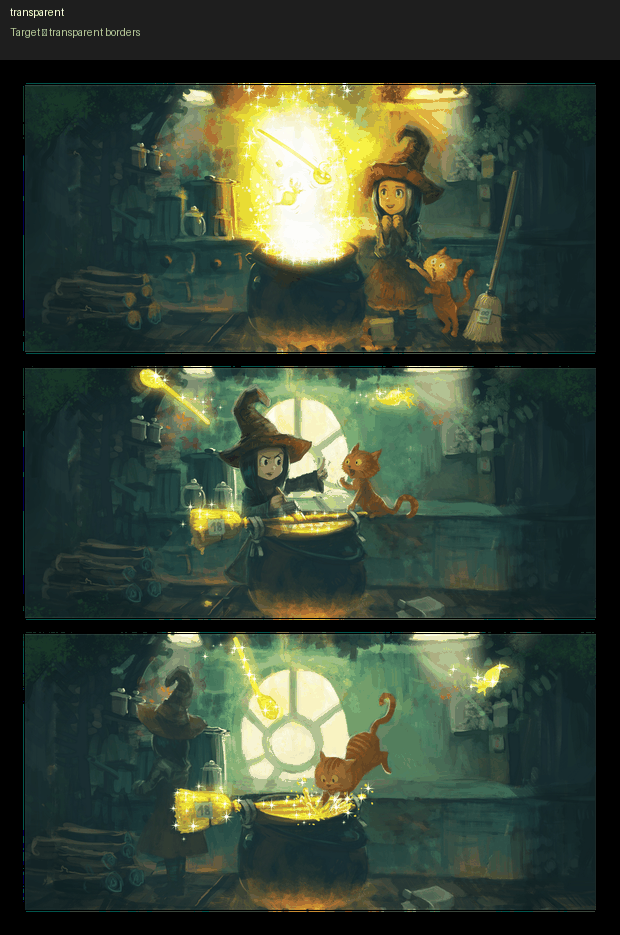

# Pepper & Carrot Dataset

> **Special thanks to [David Revoy](https://www.davidrevoy.com/)** — creator of [Pepper & Carrot](https://www.peppercarrot.com/), the open-source webcomic released under CC BY 4.0. His decision to publish not only the finished pages but the original Krita source files with full layer structure made this kind of deep, programmatic extraction possible. Without that openness, a dataset of this quality and variety simply could not exist.

A pipeline to extract clean, border-free comic panel artwork from Pepper & Carrot, packaged as a multi-variant dataset for ML training.

The goal: teach a model to remove comic panel borders and backgrounds from manhwa-style pages — handling white borders, black borders, gradient fills, JPEG compression artifacts, inked frame lines, and synthetic text overlays as input, with clean border-transparent artwork as the target.

---

## Dataset at a glance

| | |
|---|---|
| Episodes | 38 (ep01 – ep39, no ep33) |
| Pages | 281 |
| Base variants per page | 9 |
| Overlay variants per page | 4 (generated separately) |
| Renders | 281 × 2 (initial + cleaned) |

**Target** for every input variant is the same file: `preprocessing/renders/{ep}/cleaned/{page}.png` — clean artwork with borders fully transparent.

---

## Pipeline

```
download_chapters.py → extract_kra.py → process_kra.py → synthesize_dataset.py → synthesize_overlays.py
  fetch art-pack        unzip .kra        detect & remove    9 base training        SFX + bubble
  zip archives          archives          border layer       variants               overlay variants
                           ↓ (delete after process)
                    preprocessing/kra/
```

After `process_kra.py` finishes, `preprocessing/kra/` and `preprocessing/zips/` can be deleted — the full dataset is generated from `preprocessing/renders/` alone.

Overlay assets are generated once and reused:
```
make_sfx.py     → data/overlays/sfx/      (266 Korean SFX images, 7 style variants each)
make_bubbles.py → data/overlays/bubbles/  (11 speech bubble / text box shapes)
```



---

## Directory structure

```
data/
  preprocessing/
    renders/
      ep01_Potion-of-Flight/
        initial/      ← raw merged render from KRA (borders intact, any color)
        cleaned/      ← border-removed RGBA artwork  ← TARGET for all variants
      ep02_Rainbow-potions/
        ...
  dataset/
    ep01_Potion-of-Flight/
      black/              framed/             framed_cleaned/
      framed_jpeg/        framed_jpeg_cleaned/
      gradient_border/    gradient_border_inv/
      jpeg/               jpeg_cleaned/
      sfx_overlay/        sfx_overlay_cleaned/
      bubble_overlay/     bubble_overlay_cleaned/
    ep02_Rainbow-potions/
      ...
  overlays/
    sfx/       ← 266 RGBA PNG overlays
    bubbles/   ← 11 RGBA PNG overlays
  fonts/
```

---

## Dataset variants

All input variants map to the same `cleaned/` target. Pairs are named so they sort adjacent in any file browser.

### Base variants — `synthesize_dataset.py`

| Folder | Description |
|---|---|
| `black/` | Artwork composited on solid black background |
| `framed/` | White background + 1px black outline at each panel edge |
| `framed_cleaned/` | Transparent background + 1px black outline |
| `framed_jpeg/` | White bg + 1px frame + JPEG compression (quality 15) |
| `framed_jpeg_cleaned/` | Transparent bg + 1px frame + JPEG — frame bleeds as in real scans |
| `gradient_border/` | Border pixels filled black→white gradient across full page height |
| `gradient_border_inv/` | Border pixels filled white→black gradient |
| `jpeg/` | Initial render with heavy JPEG compression |
| `jpeg_cleaned/` | Cleaned RGBA with JPEG artifacts on RGB channels, alpha preserved |

#### Why so many variants?

Real-world manhwa chapters are distributed as JPEG images where black frame lines are never true `#000000` — compression bleeds colour into adjacent pixels. A model trained only on white-border inputs will fail on these. The matrix covers every combination of background style, frame presence, and JPEG degradation, forcing the model to learn the semantic concept "this is a border" rather than memorising a specific colour value.

### Overlay variants — `synthesize_overlays.py`

| Folder | Description |
|---|---|
| `sfx_overlay/` | Korean SFX text composited on the initial render (RGB) |
| `sfx_overlay_cleaned/` | Same SFX positions on the cleaned artwork (RGBA — training pair) |
| `bubble_overlay/` | Speech bubbles / text boxes on the initial render (RGB) |
| `bubble_overlay_cleaned/` | Same bubble positions on the cleaned artwork (RGBA — training pair) |

Overlays are placed per detected panel with a fixed seed (deterministic from episode + page + variant tag), so `sfx_overlay/` and `sfx_overlay_cleaned/` are pixel-aligned training pairs. Placement is ~75% edge (straddling the frame line) and ~25% background corner.



*Animated preview cycling through all variants:*



---

## How to run

```bash
pip install -r requirements.txt

# 1. Download art-pack zips (~17 GB, network-dependent — allow 30–60 min)
python3 src/download_chapters.py

# 2. Extract .kra files from zips (~5 min)
python3 src/extract_kra.py

# 3. Detect and remove border layers → saves initial/ + cleaned/ renders (~45–90 min)
#    Skips files that already have both renders, so safe to re-run after interruption.
python3 src/process_kra.py

# Optional: delete intermediates (~37 GB freed, zips and kra no longer needed)
rm -rf data/preprocessing/zips data/preprocessing/kra

# 4. Generate 9 base training variants (~80 min for all 281 pages)
python3 src/synthesize_dataset.py all

# 5. Generate SFX and bubble overlay assets, once (~2 min)
python3 src/make_sfx.py
python3 src/make_bubbles.py

# 6. Generate 4 overlay variants (~15 min)
python3 src/synthesize_overlays.py all
```

**Estimated total** (excluding download): ~2.5–3 hours on a mid-range CPU.

To reprocess only files that errored:
```bash
python3 src/process_kra.py --retry-errors
```

To process a specific episode only:
```bash
python3 src/synthesize_dataset.py ep03
python3 src/synthesize_overlays.py ep03
```

---

## Dataloader pairing

All variant folders share the same filenames, mapping 1:1 to the cleaned target:

```python
renders = Path("data/preprocessing/renders")
dataset = Path("data/dataset")
episode = "ep01_Potion-of-Flight"
page    = "E01P01.png"

input_path  = dataset  / episode / "framed_jpeg" / page
target_path = renders  / episode / "cleaned"     / page
```

For overlay pairs the cleaned variant is inside dataset/ itself:
```python
input_path  = dataset / episode / "sfx_overlay"         / page
target_path = dataset / episode / "sfx_overlay_cleaned"  / page
```

---

## Version history

Version scheme: `v1.X.Y` — `X` is the feature group, `Y` is the iteration within it.

### v1.0.0 · Initial setup
Download pipeline (`download_chapters.py`) and license attribution scraper (`create_licenses.py`). Established the project structure and `.gitignore`.

### v1.1.0 – v1.1.1 · KRA border extraction
First working extraction from `.kra` ZIP archives — parse `maindoc.xml`, decode Krita tile data, apply border mask to `mergedimage.png`. Added scored layer selection (prefers `shapelayer` over `paintlayer`), SVG rendering via cairosvg, and batch episode processing.

Established the three border layer types present in Krita files: `paintlayer` (raster white stroke), `shapelayer` (SVG vector), and `grouplayer` (composited children).

### v1.2.0 – v1.2.2 · Code structure
Split monolithic script into `extract_kra.py` and `process_kra.py`. Unified all data paths under `data/`. Renamed report output directory to `reports/`.

### v1.3.0 · LZF prefix fix
Krita tile data uses LZF compression with a 1-byte version prefix before the compressed payload. Feeding the full buffer to the decompressor caused failures across 19 files. Fix: skip byte 0 before decompressing.

### v1.3.1 · Grouplayer border support + `--retry-errors`
Some episodes wrap the border layer in a group. Added `build_group_mask` which composites all descendant paintlayers and thresholds on alpha (group border strokes are black, not white — so the white-pixel check used for raster layers would return empty masks). Added `--retry-errors` flag to reprocess only failed files without rerunning the full pipeline.

### v1.3.2 · Skip empty border masks
E28P00 has an SVG border layer with coordinates in global document space far outside the canvas viewport. The resulting mask has zero coverage. Rather than raising an error, treat it as skipped — consistent with all other P00 (cover) files which have no border layer.

### v1.4.0 – v1.4.1 · Blacklist + synthesize_dataset
E03P02 has unclipped artwork bleed: the flat merged image exposes artwork from adjacent panels in the gutter bands. Added `BLACKLISTED` dict in `process_kra.py`. Introduced `synthesize_dataset.py` to generate the multi-variant training set. All scripts moved to `src/`.

### v1.4.2 · Complete input matrix
Added `framed_jpeg` and transparent variants to cover every combination of background, frame, and JPEG degradation.

### v1.5.0 – v1.5.3 · README and visual assets
README with pipeline overview, variant table, version history, and usage instructions. Visual assets: `pipeline.png`, `variants_demo.gif`, `variants_grid.png`. `make_assets.py` added to `src/`. Language stats fixed via `.gitattributes`.

### v1.5.4 · Version history update

### v1.6.0 · SFX and bubble overlay synthesis pipeline
Added `src/make_sfx.py` (266 Korean SFX overlays, 7 style variants each) and `src/make_bubbles.py` (11 speech bubble shapes). Added `src/synthesize_overlays.py` which applies overlays per detected panel with panel-aware edge placement and deterministic seeding.

### v1.6.1 · Gradient border variants
Added `gradient_border/` and `gradient_border_inv/` — border pixels filled by a linear gradient spanning the full page height.

### v1.6.2 · Full-page gradient fix
Initial gradient was computed per-strip, making each narrow gutter too short to show a visible sweep. Fixed by using absolute Y position across the full page height.

### v1.6.3 · Transparent overlay variants
Added `sfx_overlay_transparent/` and `bubble_overlay_transparent/` as RGBA training targets for the overlay variants. Overlay positions are planned once and applied to both the initial and cleaned bases with the same seed, ensuring pixel-aligned pairs.

### v1.7.0 · Data directory restructure
Separated preprocessing intermediates from the final dataset:
- `data/preprocessing/renders/` — canonical renders (initial + cleaned per episode)
- `data/dataset/` — all ML training variants
- `synthesize_dataset.py` now reads from `renders/` directly; no KRA files needed at synthesis time.
- `process_kra.py` saves both initial and cleaned renders in a single pass.

### v1.7.1 · Rename renders and drop intermediates
`white/` → `initial/`, `transparent/` → `cleaned/`. "Initial" is the raw merged render (borders intact, any colour); "cleaned" is the border-removed transparent artwork. Dropped `preprocessing/kra/` and `preprocessing/zips/` — 37 GB freed, dataset generation runs entirely from `renders/`.

### v1.7.2 · Dataset variant rename
`transparent_*` prefix replaced with `_cleaned` suffix so each input variant sorts alphabetically adjacent to its cleaned pair (`framed` / `framed_cleaned`, `jpeg` / `jpeg_cleaned`, etc.). Same rename for overlay pairs.

### v1.7.3 · Timing estimates + asset refresh
Added per-step timing estimates to How to run. Updated `make_assets.py` for new directory structure: 15-variant grid and demo GIF, each frame drawn from a different episode. Panel detection now picks the largest panel per page.

---

## License

**Pipeline code** (all `.py` files) — [MIT License](LICENSE) © 2026 Devids Kronbergs.

**Artwork and generated dataset** — derived from [Pepper & Carrot](https://www.peppercarrot.com/) by [David Revoy](https://www.davidrevoy.com/), licensed under [CC BY 4.0](https://creativecommons.org/licenses/by/4.0/). Attribution: **"Pepper & Carrot" by David Revoy**.
